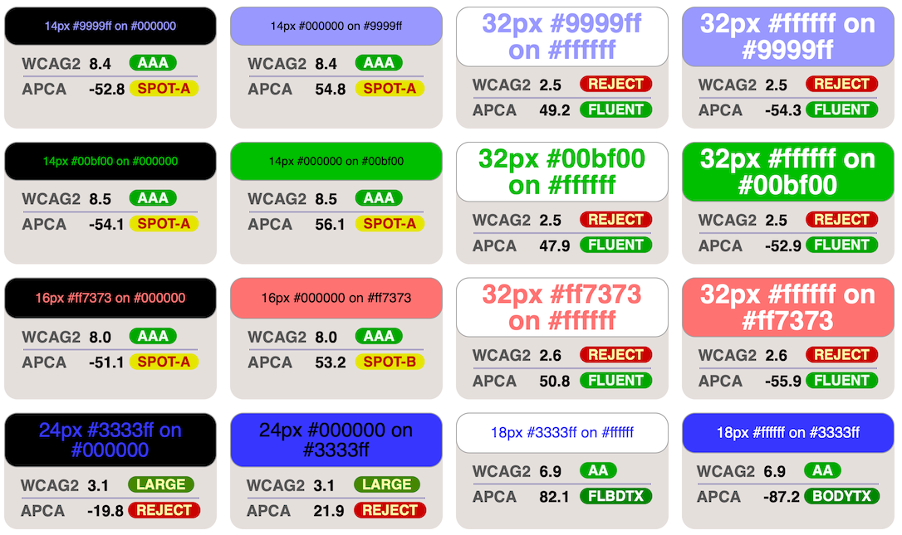

# Corrected fork of apca-introduction, with comments
User xi _(Tobias Bengfort)_ created an unauthorized repo called _"apca-introduction"_ which unfortunately is misleading. This fork is intended to clarify, make corrections, and set the record straight.

The single most important failure of xi's repo and assertions, is that he completely fails to address the primary driver of contrast, which is the spatial characteristics. In fact, his demonstrations and calculations seem to intentionally obfuscate that fact, by using test elements that are spatially above the point of contrast constancy, which make any comparison moot. Those misleading demonstrations are also corrected here in this repo.

The corrected ***"The missing introduction to APCA"*** below was revised for accuracy only, with the intention of maintaining xi's original tone and simplicity. In addition, this repo also addresses the other documents xi putforth.

-----
# The missing introduction to APCA
(Note that the actual introduction is not missing, it is called [***Why APCA***](https://git.apcacontrast.com/documentation/WhyAPCA).)

**Edit to add:** And there is a new plain language intro, intended for a general audience called ["Easy Intro to APCA"](https://git.apcacontrast.com/documentation/APCAeasyIntro)


## *What is APCA in three sentences:*
It is a supra-threshold visual contrast prediction model, that is specifically tuned to readability on self-illuminated displays. It follows human perception, including critical aspects such as spatial characteristics, meaning font weight and size or line thickness. The APCA guidelines also inform various use cases, such as body text, fluent text, sub-fluent text and spot reading text, and non-text items.

### *WCAG 2 compatibility?*
APCA is enough of a paradigm shift that it is not directly backwards compatible with the old WCAG&nbsp;2 contrast, and WCAG&nbsp;3 is some time away from being the recommendation. However, this is not due as much to the APCA math per se, but that the APCA math is accurate to allow for flexible and accurate [design guidelines](https://readtech.org/ARC/).

APCA thresholds can certainly be set to levels that are backwards compatible, but at a loss of design flexibility. This approach is used in the [Bridge-PCA](https://bridgepca.com), which is backward compatible to WCAG&nbsp;2, but using APCA technology. One of the urgent reasons Bridge-PCA is needed is the rise in popularity of *"Dark Mode."*

### *Bridge PCA for Dark Mode*
As shown above, WCAG&nbsp;2 contrast fails most with dark colors, and the results are relatively meaningless for colors for Dark Mode. APCA and Bridge&nbsp;PCA do very well with contrast prediction and guidance for dark mode.

**Here's a [short linktree](https://linktr.ee/Myndex) of related links.**      
**And a [more in depth](https://git.myndex.com) link catalog.**


The [Accessible Perceptual Contrast Algorithm (APCA)](https://apcacontrast.com/)
is a new algorithm to predict the perceived lightness contrast between two adjacent colors. It was developed to address some issues in earlier algorithms, especially for dark colors, or when the text is lighter than the background.

APCA was created by Andrew Somers at Myndex Research, and under the oversight of the Visual Contrast subgroup of Silver, and is the candidate method for contrast for WCAG&nbsp;3 (W3C Accessibility Guidelines).

The official interactive demo is available at [apcacontrast.com/](https://apcacontrast.com/). No other link is canonical nor officially approved.

## Algorithm

```js

// Estimated screen Ys from simple RGB int array [255,255,255]
function sRGBtoY(srgb) {
  var r = Math.pow(srgb[0] / 255, 2.4);
  var g = Math.pow(srgb[1] / 255, 2.4);
  var b = Math.pow(srgb[2] / 255, 2.4);
  var ys = 0.2126729 * r + 0.7151522 * g + 0.0721750 * b;

  // Soft black clamp for flare and other purposes.
  if (ys < 0.022) {
    ys += Math.pow(0.022 - ys, 1.414);
  }
  return ys;
}

// Send text and bg color, as simple RGB int arrays [255,255,255]
function contrastAPCA(tx, bg) {
  var ystx = sRGBtoY(tx);
  var ysbg = sRGBtoY(bg);
  var sapc = 1.14;
  var offset = 0.027;

  // Calculate raw SAPC contrast value
  if (ysbg > ystx) {
    sapc *= Math.pow(ysbg, 0.56) - Math.pow(ystx, 0.57);
  } else {
    sapc *= Math.pow(ysbg, 0.65) - Math.pow(ystx, 0.62);
  }

  // Clamp low Lc values to 0, otherwise offset.
  if (Math.abs(sapc) < 0.1) {
    return 0;
  } else if (sapc > 0) {
    sapc -= offset;
  } else {
    sapc += offset;
  }

  // return APCA Lc value as a signed number
  return sapc * 100;
}
```

([Source](https://github.com/Myndex/SAPC-APCA/blob/master/documentation/APCA-W3-LaTeX.md))

## Migrating from WCAG&nbsp;2.x

**Output Values**
- WCAG&nbsp;2.x produces a ratio between 1:1 and 21:1. APCA produces a value roughly between -108 to 0 for light text (on a dark background), and 0 to 106 for dark text.
    - Unlike WCAG&nbsp;2.x, APCA reports different values when you switch text color and background color (polarity sensitivity).
    - The result of APCA is negative for light text on dark background. You will usually work with the absolute value though, except for maximum contrast which is presently set at Lc -90.
 
**Thresholds**
- WCAG 2.x defined three thresholds: 3:1, 4.5:1, and 7:1.
    - These *roughly* correspond to Lc45, Lc60, and Lc75 as functionally equivalent, but not backwards compatible. 
    - The backwards compatible levels are APCA Lc58, Lc72, Lc85, provided the lightest color is sent to the "background" input of APCA. (i.e. disregard polarity just as WCAG&nbsp;2 does).
- APCA Bronze Level Defines six thresholds from Lc15, Lc30, Lc45, Lc60, Lc75, and Lc90
    - Lc15: Invisibility point for some individuals.
    - Lc30: Minimum for any sub-fluent or spot text of any use case.
    - Lc45: Large (>36px) fluent text, or subfluent text minimum.
    - Lc60: Medium (>24px) fluent text
    - Lc75: Minimum for body text (>18px)
    - Lc90: Preferred for body text
 
**Practical Application**
- Compared to WCAG&nbsp;2.x, APCA reports drastically lower contrast for darker colors. It also reports slightly higher contrast for lighter colors. This is in accordance with human perception.
- Unlike WCAG&nbsp;2.x, APCA divides needed contrast into use case categories.
    - In some use cases, such as for columns of body text, APCA is stricter.
    - APCA is more flexible though, by handling for "derated" use cases. For instance, non-content text like a copyright bug are permitted lower contrast (prevents distraction).

Also see [APCA In A Nutshell](https://git.apcacontrast.com/documentation/APCA_in_a_Nutshell).

## Comparative Examples
These examples are _based_ on xi's example script. The original script and method was deeply flawed, and has been corrected. These examples below are intended to maintain the same comparative intent as xi claims to have intended, but using useful and correct math.
[](https://myndex.github.io/apca-introduction/examples/)
[](https://myndex.github.io/apca-introduction/examples/)
[](https://myndex.github.io/apca-introduction/examples/)

### Official Comparison from Myndex Research:
This comparison uses achromatic grays as those define readability, making the comparative differences clearly evident.


## Status

WCAG&nbsp;2 is a guideline developed and recommended by the W3.org. While WCAG&nbsp;2 is not legally binding itself, it has become a normative part of some regulations in some specific jurisdictions around the globe. The fact that there is a need to define contrast specifications for legal reasons makes it all the more important that there be a perceptually accurate contrast method to do so. This need led to the Genesis of the APCA.

Currently both APCA and the future WCAG&nbsp;3.0 are in active development. At the time of this writing, neither is officially recommended by the W3C.

APCA is also being developed independently for other standards and guidelines beyond web content, and is rapidly being adopted by software developers and content designers.

## Evaluating APCA

Evaluating a contrast algorithm is fairly straight forward as far as determining perceptual uniformity, or in other words, efficacy in terms of the predicted, relative amount of contrast across the visual range. This is because all sighted users have *similarly shaped* contrast sensitivity curves when it comes to achromatic luminance (literally, the colorless, black to white range of lightness). 

Luminance is the measure of light coming from the display, and perceived lightness is how a human judges the lightness or brightness, in the context of the surrounding environment. Luminance is processed by the human vision system in a manner that makes it critical for readability.

On the other hand, the *thresholds* chosen for guidelines—i.e., how much contrast does a given element need—is more complicated. **_All sighted users have substantial contrast needs for best readability._** Some users have impairments that cause a reduced contrast sensitivity, and those users may need higher contrasts in general. 

Note: there are some claims that some users may be over-sensitive to very high contrasts, and they then need lower contrasts in some situations such as with large bold elements. Examining this aspect of contrast perception, we find it is more related to excessively high luminance relative to a particular adaptation state. In other words it's not contrast per se, but an excessive luminance peak value, or a luminous intensity that causes significant glare and related issues. Unfortunately, this idea has been misinterpreted, resulting in poor contrast across the web. Article: [_"Please Stop Using Gray Text"_](https://tangledweb.xyz/please-stop-using-grey-text-3d3e71acfca8)

## More

For a deeper dive, start with ["Easy Intro to APCA"](https://git.apcacontrast.com/documentation/APCAeasyIntro) and the  [short linktree](https://linktr.ee/Myndex) and the more in depth [link catalog](https://git.myndex.com) of related resources.

