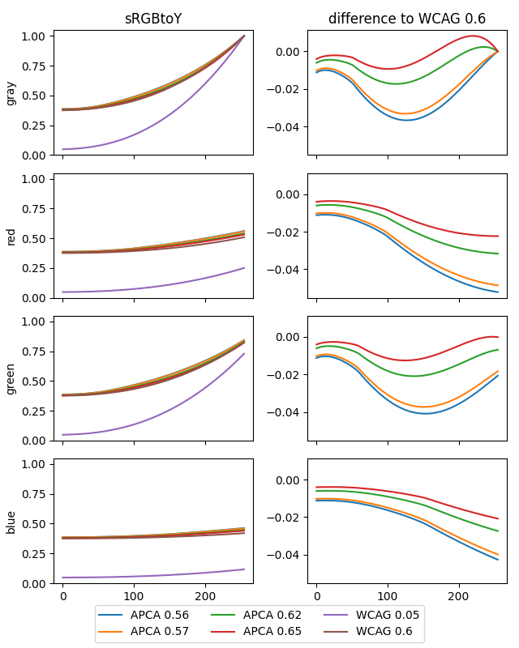
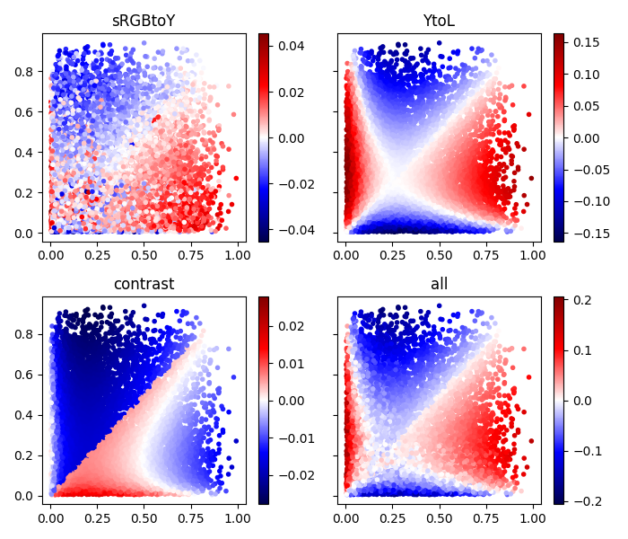

# Derailed analysis of APCA
Below is user xi's flawed analysis of APCA, where he abstracts the math and creates his own version of the math and eliminates many of the key properties of the APCA method in performing his analysis. But then he goes further to create his own separate version of WCAG 2 contrast math, which is a crude and incomplete attempt to reverse engineer the APCA contrast curves, and then attempts to makes claims that APCA is similar to WCAG 2. In short, the analysis below is disingenuous at best, and only serves to obfuscate and confuse anyone reading this.

I've forked this repo so that I can point out the flaws and misconceptions he presents. Original statements quoted and in italics.

-----
> ## _Detailed analysis of APCA (2022-07-16)_

> _I am a regular web developer with a bachelor's degree in math, but **without any
training in the science around visual perception**. That's why I cannot evaluate
whether APCA is *better* than WCAG 2.x. Instead this is a systematic
comparison of their mathemetical properties._

If xi has no knowledge of the science of visual perception, then xi should not be making unsupported opinions as if they were facts.

> ## _Context: The Web Content Accessibility Guidelines (WCAG)_

> _APCA was developed to address some issues related to contrast in the Web
Content Accessibility Guidelines (WCAG). WCAG is an official W3C
recommendation, a normative part of many laws all over the world, and generally
a good read._

WCAG 2 is not a normative part of "many" laws. Internationally, _some_ nations use WCAG 2 as the basis for regulation relating to governmental websites. WCAG 2 is not law in the United States except in some narrow areas (25% of airport kiosks but follow WCAG2), though it is part of the 508 government regulations which apply to government web sites and government procurement of certain IT. 508 has two major exceptions: 1) alternate means. This allows any alternative method other than WCAG to be used, provided it improves actual accessibility, 2) Commercially available. If the technology that follows WCAG 2 is not commercially available, then WCAG does not need to be followed for that specific situation.

It is extremely rare for WCAG 2 to be "legally" applied across the board.


> _WCAG faces a difficult challenge though: There is no one-size-fits-all solution
for accessibility. Different humans have different needs, and different
situations require different kinds of support._

This can only be correctly handled with user customization, something that the W3C AGWG has failed to promote or develop.

> _This is also the case in the context of color contrast: vision impairments,
ambient light, and screen settings can all have a pronounced impact on
legibility. None of these are known beforehand by website authors, so the rules
provided by WCAG need to work regardless of these factors._

No. There are defined and well known baseline standards relating to common case ambient environments and screen standards. Display standards define adjustment criteria, CSS provides size metrics that are based on visual angle, and manufacturers work with these in developing technologies to extend the operating ranges.

WCAG2 makes spurious claims that important factors such as antialiasing can not be considered, which is bizzare when that technology has been an important part of display technology for decades.


> _Faced with the question whether it wanted to give precise instructions (that
might not be ideal in every situation) or give nuanced but ultimately vague
advise, WCAG went with the former. So today WCAG provides a list of detailed
steps for evaluating a website. Many of these checks can be automated. It does
not always result in perfect accessibility, but it gives lawmakers a solid
baseline._

Opinion not based in fact. Some of WCAG 2, such as that relating to the structure of the document needed for accessibility (i.e. needed for screen reader support) is certainly important. But some of WCAG 2 that relate to perception, such as contrast, are not based in science, not empirically tested nor evaluated, were in fact objected to at the time (objections ignored), and otherwise unsupportable as law.

> ## _Components of contrast_

> _When we speak about contrast, we actually mean a few different things:_

It is true that contrast means a few different things, but listed below are not those things. Listed below all relate to one _single_ kind of contrast.

> -   _How is the contrast between two colors calculated?_
> -   _Which thresholds are used to decide whether that contrast is sufficient?_
> -   _How do other features like font size and font weight factor into that
    decision?_
> -   _Which parts of the UI need to be checked?_

While these are the things that relate specifically to _readability contrast_. Some other important factors are:
- Critical contrast for fluent readability
- Critical size/weight for fluent readability
- The effect of line and letter spacing, padding, other whitespace.
- Visual hierarchy of contrasts


> _In the following sections I will take a closer look at how WCAG 2.x and APCA
answer each of these questions._

No, xi does not answer nor address these questions.


> ## _The contrast formula_

> _There is no *true* contrast formula. Instead, these formulas are supposed to
predict how most humans perceive a color combination, even if they cannot be
correct 100% of the time._

This is a weird statement. Both color and contrast are not real, they are perceptions. I have no idea what he means by "true" contrast formula, and it may be a translation issue as his native language is german.


> ### _A naive approach_

```js
function sRGBtoY(srgb) {
  return (srgb[0] + srgb[1] + srgb[2]) / 3;
}

function contrast(fg, bg) {
  var yfg = sRGBtoY(fg);
  var ybg = sRGBtoY(bg);

  return ybg - yfg;
};
```
> _This naive approach provides a baseline for the other formulas we will look at.
It does not consider anything we know about human vision, but it already
features the basic structure: We first transform each color to a value that
represents lightness. Then we calculate a difference between the two lightness
values._

No. This naive approach is fundamentally wrong, and no, it does not provide any sort of baseline.

More importantly, it does NOT calculate "lightness" which is a perceptual quality, and the claim that it represents lightness, a perceptual sensation (subject to context) as opposed to _light_ or _luminance_ (a physical measure) further underlines xi's lack of understanding of the science here.

I am not certain the motivation for presenting it here, and further, if a naive approach were to be included for a baseline, then the most simple, such as "simple contrast", should be used. Otherwise it only serves to confuse the reader and obscure the point.


> ### _WCAG 2.x_

```js
function gamma(x) {
  if (x < 0.04045) {
    return x / 12.92;
  } else {
    return Math.pow((x + 0.055) / 1.055, 2.4);
  }
}

function sRGBtoY(srgb) {
  var r = gamma(srgb[0] / 255);
  var g = gamma(srgb[1] / 255);
  var b = gamma(srgb[2] / 255);

  return 0.2126 * r + 0.7152 * g + 0.0722 * b;
}

function contrast(fg, bg) {
  var yfg = sRGBtoY(fg);
  var ybg = sRGBtoY(bg);

  var c = (ybg + 0.05) / (yfg + 0.05);
  return (c < 1) ? 1 / c : c;
};
```
**_PARTIALLY INCORRECT_**
This is the WCAG2 formula EXCEPT that WCAG2 does not care which is foreground or which is background, but it does demand which is lighter and which is darker. This is addressed obliquely in the return ternary statement.

> _In WCAG 2.x we see the same general structure, but the individual steps are
more complicated:_

No, in WCAG 2 the return is a ratio, not a difference. The naive approach xi presented earlier used a difference.

> _Colors on the web are defined in the [sRGB color space]. The first part of this
formula is the official formula to convert a sRGB color to luminance. Luminance
is a measure for the amount of light emitted from the screen. Doubling sRGB
values (e.g. from `#444` to `#888`) does not actually double the physical
amount of light, so the first step is a non-linear "gamma decoding". Then the
red, green, and blue channels are weighted to sum to the final luminance. The
weights result from different sensitivities in the human eye: Yellow light has
a much bigger response than the same amount of blue light._

The weights here are derived from the CIE 1931 2° standard observer. While the CIE 1931 2° standard observer is the cornerstone of most colorimetry, it is also known that it is deficient in some ways.


> _Next the [Weber contrast] of those two luminances is calculated. Weber contrast
has been called the ["gold standard" for text contrast]. It is usually defined
as `(yfg - ybg) / ybg` which is the same as `yfg / ybg - 1`. In this case, 0.05
is added to both values to account for ambient light._

Weber is nothing more than a log of the stimulus to a reference. While it is true that at the very beginning of the early research into perceptual contrast, I _once_ referred to Weber as the "gold standard for contrast of text", but to clarify, that applied specifically and only to dark text on a light background, and at or near the _threshold_ JND. Weber becomes increasingly invalid as there is departure from those parameters. It should be mentioned that Weber is roughly 180 years old. In the 1960s, Stevens pointed out how Weber was flawed, and presented the power curve solution. More recently, Poynton pointed out that perception curves were more of a hybrid between log and power curves.

Where Weber has some utility in terms of research for the purposes of certain comparisons, it is not at all useful for design guidance in today's world of grpahicslly rich web content.

> _The shift by 1 is removed
because it has no impact on the results (as long as the thresholds are adapted
accordingly)._

The problem here is that it results in incongruent results compared to other methods, and therefore increases confusion in what is already a difficult subject matter. Put another way, "will the real contrast math please stand up?"

> _Finally, the polarity is removed so that the formula has the same results when
the two colors are switched._

> _All in all this is a pretty solid contrast formula (at least from a theoretical
perspective), as it just reuses parts from well established standards._

The only part of this that is the "contrast formula" is the `(ybg + 0.05) / (yfg + 0.05)` which was not a part of any standard anywhere, so claiming it was somehow founded in "well established standards" is patently false. Also, the original, which still exists in WCAG 2.0 is also not using the correct math for the conversion to luminance (this was only recently corrected for WCAG 2.2).


> ### _APCA_

```js
function sRGBtoY(srgb) {
  var r = Math.pow(srgb[0] / 255, 2.4);
  var g = Math.pow(srgb[1] / 255, 2.4);
  var b = Math.pow(srgb[2] / 255, 2.4);
  var y = 0.2126729 * r + 0.7151522 * g + 0.0721750 * b;

  if (y < 0.022) {
    y += Math.pow(0.022 - y, 1.414);
  }
  return y;
}

function contrast(fg, bg) {
  var yfg = sRGBtoY(fg);
  var ybg = sRGBtoY(bg);
  var c = 1.14;

  if (ybg > yfg) {
    c *= Math.pow(ybg, 0.56) - Math.pow(yfg, 0.57);
  } else {
    c *= Math.pow(ybg, 0.65) - Math.pow(yfg, 0.62);
  }

  if (Math.abs(c) < 0.1) {
    return 0;
  } else if (c > 0) {
    c -= 0.027;
  } else {
    c += 0.027;
  }

  return c * 100;
};
```

> _Again we can see the same structure: We first convert colors to lightness, then
calculate the difference between them. _

Actually NO.

First we convert to "estimated screen luminance" a physical measure of light, but NOT lightness, and which includes some pre-shaping and shifting of hue weighting.

THEN we pre-shape the luminance with a soft clip at black which emulates flare components (in a way similar to DICOM).

Only THEN are the inputs converted to lightnesses, and done so using independent exponents which are dependent on polarity, as the exponents define CONTEXT SENSITIVE PERCEPTUAL LIGHTNESS OF TEXT.


> _However, in order to be able to compare
APCA to WCAG 2.x, I will make some modifications:_

The modifications made are not approved, and are a violation of the APCA license.

> -   _The final steps do some scaling and shifting that only serves to get nice
    threshold values. Just like the shift by 1 in the WCAG formula, this can
    simply be ignored._

The scale/offset adjust for perceptual uniformity. xi can't discard it just because he doesn't understand it.


> -   _I will also ignore the `< 0.1` condition because it only affects contrasts
    that are too low to be interesting anyway._

The output clamp OR one of the low-end extensions is required, especially if you are going to make tests using random generated colors.

> -   _The contrast is calculated as a difference, not as a ratio as in WCAG. I
    will look at the `exp()` of that difference. Since
    `exp(a - b) == exp(a) / exp(b)`, this allows us to convert the APCA formula
    from a difference to a ratio. Again I user the same trick: Since `exp()` is
    monotonous, it does not change the results other than moving the
    thresholds._

xi is not adjusting thresholds for apples to apples comparisons, and this is part of the most significant flaw in the approach.

But also, the claim that it is monotonic is wrong. Lc 45 through Lc 90 moves in increments of 15. But using Math.exp() this changes with every level. And this is not even adding in the other corruption that xi introduced with the other unapproved changes made. 

### Take a look:

```js
console.log('lc45 - ' + Math.exp(0.45));
console.log('lc60 - ' + Math.exp(0.6));
console.log('lc75 - ' + Math.exp(0.75));
console.log('lc90 - ' + Math.exp(0.9));

console.log('\ncompare to WCAG2 A');
console.log('3 / lc45 - ' + 3 / Math.exp(0.45));
console.log('4.5 / lc60 - ' + 4.5 / Math.exp(0.6));
console.log('7 / lc75 - ' + 7 / Math.exp(0.75));

console.log('\ncompare to WCAG2 B');
console.log('3 / lc60 - ' + 3 / Math.exp(0.6));
console.log('4.5 / lc75 - ' + 4.5 / Math.exp(0.75));
console.log('7 / lc90 - ' + 7 / Math.exp(0.9));

OUTPUT

// exp(Lc) 
> "lc45 - 1.568312185490169"
> "lc60 - 1.8221188003905089"
> "lc75 - 2.117000016612675"
> "lc90 - 2.45960311115695"

// compare to WCAG2 A 
> "3 / lc45 - 1.9128844548653197"
> "4.5 / lc60 - 2.469652362423119"
> "7 / lc75 - 3.3065658691871027"

// compare to WCAG2 B 
> "3 / lc60 - 1.6464349082820793"
> "4.5 / lc75 - 2.125649487334566"
> "7 / lc90 - 2.8459876181841937"

```
In the first section, the distance between levels in non-linearized, removing the perceptual uniformity.

Then in the comparisons to WCAG 2, the relationship is completely broken and not at all aligned as it should be. You don't need to be a math major to see that the delinearization being done here incorrectly skews any comparative result.

If we try and scale that, using a factor of about 2.47, to try and align WCAG 2 with APCA, we get:

```js

console.log('lc45 - ' + Math.exp(0.45) * 2.47);
console.log('lc60 - ' + Math.exp(0.6) * 2.47);
console.log('lc75 - ' + Math.exp(0.75) * 2.47);
console.log('lc90 - ' + Math.exp(0.9) * 2.47);

console.log('\ncompare to WCAG2 A');
console.log('3 / lc45 - ' + 3 / (Math.exp(0.45) * 2.47));
console.log('4.5 / lc60 - ' + 4.5 / (Math.exp(0.6) * 2.47));
console.log('7 / lc75 - ' + 7 / (Math.exp(0.75) * 2.47));

console.log('\ncompare to WCAG2 B');
console.log('3 / lc60 - ' + 3 / (Math.exp(0.6) * 2.47));
console.log('4.5 / lc75 - ' + 4.5 / (Math.exp(0.75) * 2.47));
console.log('7 / lc90 - ' + 7 / (Math.exp(0.9) * 2.47));


> "lc45 - 3.8737310981607176"
> "lc60 - 4.5006334369645575"
> "lc75 - 5.228990041033307"
> "lc90 - 6.075219684557666"
> "
compare to WCAG2 A"
> "3 / lc45 - 0.7744471477187529"
> "4.5 / lc60 - 0.9998592560417485"
> "7 / lc75 - 1.338690635298422"
> "
compare to WCAG2 B"
> "3 / lc60 - 0.6665728373611657"
> "4.5 / lc75 - 0.8605868369775571"
> "7 / lc90 - 1.15222170776688"

```

And the conclusion is that using exp() is not a valid way to compare here, no matter how you slice it.


> _With those changes. All other differences between APCA and WCAG 2.x can be
pushed into `sRGBtoY()`:_

The changes are notwithstanding, but yes the sRGBtoY can be mod like this EXCEPT it is NOT permissible to use Math.exp() as is shown. 

```js
function sRGBtoY_modified(srgb, exponent) {
  var r = Math.pow(srgb[0] / 255, 2.4);
  var g = Math.pow(srgb[1] / 255, 2.4);
  var b = Math.pow(srgb[2] / 255, 2.4);
  var y = 0.2126729 * r + 0.7151522 * g + 0.0721750 * b;

  if (y < 0.022) {
    y += Math.pow(0.022 - y, 1.414);
  }
  return Math.exp(Math.pow(y, exponent));
}
```


> _An interesting feature of APCA is that it uses four different exponents for
light foreground (0.62), dark foreground (0.57), light background (0.56), and
dark background (0.65). `sRGBtoY_modified()` takes that exponent as a second
parameter._

> _Now that we have aligned the two formulas, what are the actual differences?_

The claim that the two formula are "aligned" is patently false. 

> _This conversion again uses sRGB coefficients. However, the non-linear part is
very different. The author of APCA provides some motivation for these changes
in the article [Regarding APCA Exponents]. The main argument seems to be that
this more closely models real-world computer screens._

The real difference is a shift in the linearization exponent from the "effective 2.2" of WCAG2 to 2.4, and the combining of the flare/black adjustment into the soft-clamp.

> _To get a better feeling for how these formulas compare, I plotted the results
of `sRGBtoY()`. In order to reduce colors to a single dimension, I used gray
`[x, x, x]`, red `[x, 0, 0]`, green `[0, x, 0]` and blue `[0, 0, x]` values._

> _I also normalized the values so they are in the same range as WCAG 2.x. I used
factors (because they do not change the contrast ratio) and powers (because
they are monotonous on the contrast ratio)._

No, and for the same reasons this is an incorrect approach as defined above.

But to add, this analysis is mixing up light (luminance) and lightness, and making spurious comparisons.


```js
var average_exponent = 0.6;
var y0 = Math.exp(Math.pow(0.022, 1.414 * average_exponent));
var y1 = Math.exp(1);

function normalize(y) {
  // scale the lower end to 1
  y /= y0;

  // scale the upper end to 21
  // we use a power so the lower end stays at 1
  y = Math.pow(y, Math.log(21) / Math.log(y1 / y0));

  // scale down to the desired range
  return y / 20;
}
```
This method of normalizing corrupts and distorts the result to the point it is not at all useful.



> _The four curves for APCA are very similar._

The curves are very clearly NOT AT ALL similar. This is a bizarre statement. But also, let's not forget that xi altered the shapes of APCA with the distortions noted above.

> _Despite the very different formula, the WCAG 2.x curve also has a similar shape._

Notwithstanding comment. They are curves, but they are so clearly different bizarre statements to the contrary have me questioning the motives herein.

> _I added a modified WCAG 2.x curve
with an ambient light value of 0.4 instead of 0.05. This one is very similar
to the APCA curves. The second column shows the differences between the APCA
curves and this modified WCAG 2.x. 0.4 was just a guess, there might be even
better values._

There is no justification for the adding of 0.4: it is not supported by any physical measure. That it does grossly and incompletely reverse engineer part of the APCA curves is irrelevant. It's use here is clearly an attempt to mislead. It absolutely should NOT be used in this area of analysis whatsoever. If it is to be explored, it MUST be explored SEPARATELY and not claimed to be WCAG2 because it is NOT.


> _I also wanted to see how the contrast results compare. I took a random sample
of color pairs and computed the normalized APCA contrast, WCAG 2.x contrast
(without removing the polarity) and the modified WCAG contrast with an ambient
light value of 0.4._

0.4 is not an "ambient light value" and again underscores a misunderstanding of the science here.



> _In the top row we see two scatter plots that compare APCA to both WCAG
variants. As we can see, they correlate in both cases, but the modified WCAG
2.x contrast is much closer._

These scatter plots are non-sensical, and along with the maths are weighted to minimize the actual differences. Importantly, xi used log scales to minimize the differences.

> _In the bottom row we see two more scatter plots. This time the X axis
corresponds to foreground luminance and the Y axis corresponds to background
luminance. The color of the dots indicated the differences between the
respective formulas, calculated as `log(apca / wcag)`. As we can see, the
biggest differences between APCA and WCAG 2.x are in areas where one color is
extremely light or extremely dark. For light colors, APCA predicts an even
higher contrast (difference is in the same direction as contrast polarity). For
dark colors, APCA predicts a lower contrast (difference is inverse to contrast
polarity)._

Again, these scatter plots serve only to confuse, and not to illuminate, They are meaningless in what they are presenting.

**A mathematically accurate comparison of WCAG 2 and APCA [can be seen here](https://github.com/Myndex/SAPC-APCA/discussions/30#discussioncomment-1904967).**

> _To sum up, the APCA contrast formula is certainly not as obvious a choice as
the one from WCAG 2.x._

I don't know what that means.

> _I was not able to find much information on how it was
derived._

There are multiple white papers and extensive documentation regarding how APCA was developed and the peer reviewed scientific consensus of CAMs and Vision science upon which APCA rests. Again, the place to start is [git.myndex.com](https://git.myndex.com) It is clear that xi has not actually read the documentation, and this opinion is based on my other interactions with him, such as when he was claiming he "could not find the math" when it is literally the FIRST document in the documentation folder at the repo, and ALSO listed in all of the white papers, and in multiple readme files.


> _A closer analysis reveals that it is actually not that different from
WCAG 2.x, but assumes much more ambient light. More research is needed to
determine if this higher ambient light value is significant or just an
artifact of the conversion I did._

This is again a spurious statement coming from a layperson. None of these assertions have any relevance to ambient light. And the "not that different" statement is not borne out by actual analysis that demonstrates that WCAG2 incorrectly passes 47% of random color pairs, and incorrectly rejects 22% to 60% of random color pairs.

And this is not even delving into use cases.

> _As we have seen, using a polarity-aware difference instead of a ratio is not a
significant change in terms of results. However, in terms of developer
ergonomics, I personally feel like it is easier to work with. So I would be
happy if this idea sticks._

Polarity awareness adds approximately 10% to 15% in accuracy. 

Outside of polarity, APCA results are significantly different, as already discussed and demonstrated.

> ### _Spatial frequency_
> _Smaller text is generally harder to read than bigger text._ 

No, text is easiest to read within the range of 0.2° to 2.0° of visual angle (Legge et alia)

> _In a more general sense, we can speak about the spatial frequency of **features**. This is usually measured in cycles per degree (cpd), since the visual field is measured as an angle._

We speak of the spatial frequency of stimuli. The size of the retinal image is defined as visual angle. The capital E is 2.5 cycles vertically.

> _If content is easy to read because of its spacial frequency, I do not need as much color contrast. On the other hand, if the spatial frequency is bad, more color contrast is needed._

Spatial frequency is not "good or bad" it is high or low, and the question then is what is the appropriate spatial frequency for best fluent readability for a given acuity. 

> _There is one caveat though: The spatial frequency only defines the contrast threshold under which a pattern is not perceivable at all. Above that it has barely any effect. So we the best way to use it is to define a minimum required color contrast based on spatial frequency._

### _GENERALLY FALSE_
It is true that the CS curve is based on the JND threshold, but it is absolutely false that all of the supra threshold is in contrast constancy, and that is a misreading or misunderstanding of the literature. The contrast constancy effect IS ALSO a product of spatial frequency, and it is also FAR supra threshold. That is, there is a range from JND to the constancy level that is NOT subject to the constancy effect. And that is particularly wider at higher spatial frequencies. This is academic and ample more recent studies define it more completely. [A](https://pubmed.ncbi.nlm.nih.gov/25026464/) [B](https://pubmed.ncbi.nlm.nih.gov/8828197/). And for the record the typical critical size for fluent body text is about 12cpd.


> _Interestingly, a lower spatial frequency is not always easier to read though. Studies have shown that the optimal spatial frequency is at about 5-7 cycles per degree. Below that, features get slightly harder to detect. (Perhaps that is the reasons for the "you don't see the forest among the trees" phenomenon.)_

You are conflating different bits of data, including non-relevant aspects of the CS curve.

The CS curve is created using sinusoidal gratings. However, text has a "sharp edge" therefore large bold text is a combination of _both_ low and high spatial frequencies (see signal theory and square waves).

PEAK contrast sensitivity is approx. 2 to 4 cpd. However, a basic latin letterform can be defined as ~2.5 cycles. (The vertical dimension of capital E is 2.5 cycles).

**The scientific consensus on "best readability" is text where letterforms subtend between 0.2° and 2.0° of visual angle. (Lovie-Kitchen, Whittacker, Bailey, Legge et alia)**

> _It is not obvious how to define spatial frequency in the context of the web._ 

Except that **_it is obviously defined_** in CSS with the CSS reference px which is further defined as 1.278 arc minutes of visual angle.

> _For text, font size and weight certainly play a role. But different fonts have wildly different interpretations of these values._

Which is WHY APCA guidelines are based on a REFERENCE FONT.

> _Since fonts depend on user preference, we cannot know beforehand which fonts will be used._

This is a bizarre statement. Fonts do not "depend on user preference" they are defined in the CSS, therefore the author definitely knows before hand what font(s) they are choosing.

> _We also don't know the size of device pixels or how far the user is from the screen._

As for device pixels, we don't need to know that, that is up to the manufacturer, but we do have the _**GUIDE to that relationship**_, including how close the device is used, and that is the CSS reference px, as stated above.

See this chart:


> _So how do WCAG 2.x and APCA tackle this topic?_

WCAG 2 ignores it, though there is a single breakpoint at 24px, which happens to be about the point where antialiasing effects come into play.

APCA guidelines on matching to the reference font are [here](https://github.com/Myndex/SAPC-APCA/discussions/28).


> ### _WCAG 2.x_

> _WCAG 2.x makes the distinction between regular and [large text]. Large text is
defined as anything above 18 point or 14 point bold. The definition comes with
a lot of notes that explain the limits of that approach though, e.g. that some
fonts are extremely thin._

A lot of notes... that are non-normative in nature, so not actionable as far as regulations go.

Also, the use of 18 & 14 point is weird when px is the canonical reference unit. This has caused a lot of confusion, with people using 18px and 14px, when in fact it should be 24px and 18.7px.


> _WCAG 2.x also comes with some rules that allow users to adapt spatial frequency
to their needs: [1.4.4] requires that users can resize the text, [1.4.10]
requires that they can zoom the whole page, and [1.4.12] requires that they can
adjust text spacing._

Yes, user adjustment of size is the most important way to accommodate acuity.


> _So WCAG 2.x doesn't really attempt to model spatial frequency for web content.
It elegantly works around the issue by handing control over to the users who
have all the facts._

You are missing the point. APCA guidelines also specify that users must have zoom control and to a substantially greater degree than that defined by WCAG 2.

### _MISSING THE POINT_
But again that is not the point. The _POINT_ is that **SPATIAL FREQUENCY is the primary driver of CONTRAST**, so a contrast metric like WCAG 2 that ignores spatial frequency and focuses only on a simple pair of colors is functionally ignoring the biggest driver of contrast.


> ### _APCA_

> _Conversely, APCA [does attempt to model spatial frequency]:_

> 1.  _If the font has an x-height ratio of less than 0.52, increase the size by a
    factor of `0.52 / xHeightRatio`._
> 2.  _Experimentally find a weight offset so the font has a similar weight to
    Arial or Helvetica._
> 3.  _Consider additional font features and adapt the values accordingly._
> 4.  _Use the lookup table provided at the link above to find a minimum contrast
    for the given combination of size and weight._

This actually depends on the conformance level. The base level, BRONZE, conformance is more relaxed (similar to WCAG 2). The requirement for "font alignment" to a reference font is intended for Silver and Gold levels.


> _WCAG 3 is still an early draft and does not yet contain many guidelines. I
assume that guidelines similar to 1.4.4, 1.4.10, and 1.4.12 will again be
included. So the strategy of giving users control over spatial frequency will
still work._

There is more in the pending pull requests for WCAG 3.

Users should not be blocked from adjusting to their needs. But also, guidelines needs to be in touch with reality, and in this case that means using metrics that make sense. Many of the metrics listed are not at all consistent due to the complete lack of standardization among font families.

> _With the more sophisticated link between spatial frequency and color contrast,
user intervention might be less relevant though. However, the model described
above is complicated and leaves a lot of wiggle room, especially in steps 2 and
3._

There is "wiggle room" in terms of contrast in the first place, as it is a sliding scale relative to levels from spot reading, sub fluent, fluent and best fluent readability. It is not a binary choice, and attempting to make it binary is a flawed point of view.


> ## _Non-text contrast_

> _So far we have mainly looked at text. But other parts of a website also need to
be distinguishable. The concept of spatial frequency was explicitly picked
because it can cover those cases. What do WCAG 2.x and APCA have to say about
this?_

Non-text contrast has long been a part of APCA. It is discussed in [more detail here](https://github.com/Myndex/SAPC-APCA/discussions/39).


> ### _WCAG 2.x_

> _[1.4.11] is specifically about this issue. It basically says that all non-text
content that is not inactive, decorative, or controlled by the browser must
meet contrast requirements. Spatial frequency is not considered in this case.
It is also not always clear which parts of the UI are decorative and which are
actually relevant._

And 1.4.11 is one of the most incorrect SCs of WCAG 2, and is citing self-referential and unsupportable documentation, and importantly, fully disregarding spatial frequency in an SC where spatial frequency is of the most importance.


> ### _APCA_

> _As of today, APCA focusses mostly on text. Its sophisticated approach to
spatial frequency has a lot of potential for non-text content. I could not yet
find any discussion of that though._

Non-text contrast has long been a part of APCA. It is discussed in [more detail here](https://github.com/Myndex/SAPC-APCA/discussions/39).


> ## _Thresholds_

> ### _WCAG 2.x_

> _WCAG 2.x defines 3 thresholds: 3, 4.5, and 7._

> -   _non-text content must have a contrast of at least 3_
> -   _large text must have a contrast of at least 3 (AA) or 4.5 (AAA)_
> -   _other text must have a contrast of at least 4.5 (AA) or 7 (AAA)_
> -   _logos and inactive or decorative elements are exempted_

> _How these values were derived is not completely clear:_

> There was some user testing associated with the validation of the 2.0
> formula. I could not quickly find a cite for that. My recollection is that
> the hard data pointed to a ratio of 4.65:1 as a defensible break point. The
> working group was close to rounding that up to 5:1, just to have round
> numbers. I successfully lobbied for 4.5:1 mostly because (1) the empirical
> data was not overwhelmingly compelling, and (2) 4.5:1 allowed the option for
> white and black (simultaneously) on a middle gray.\
> -- <https://github.com/w3c/wcag/issues/695#issuecomment-484187617>

I discuss some of the fallacies involved in the development of WCAG 2 [in this thread](https://github.com/w3c/wcag/issues/1705#issuecomment-1027058976).

> ### _APCA_

> _APCA defines 6 thresholds: 15, 30, 45, 60, 75, 90._

The thresholds are only for the lowest, bronze level conformance, and mainly as a "general guideline". APCA employs continuous sliding scales for greater accuracy.

That is, threshold can be used as a rough guideline, but automated design systems can employ a fully interpolated sliding scale for determining optimum values.

> _The required threshold depends on the spatial frequency (see above). 45, 60,
and 75 loosely correspond to 3, 4.5, and 7 in WCAG 2.x._

The thresholds depend on a combination of spatial frequency and use cases, as discussed in the documentation.

> _Again I generated random color pairs and used them to compare APCA to WCAG 2.x:_

Because invalid math is used, these faux analysis have been deleted. [A correct comparison can be seen here](https://github.com/Myndex/SAPC-APCA/discussions/30#discussioncomment-1904967) 


> ## _Conclusion_

> _In this analysis I took a deeper look at the Accessible Perceptual Contrast
Algorithm (APCA), a new algorithm to predict visual contrast. I compared it to
an existing algorithm that has been part of WCAG 2.x, the current standard for
accessibility testing for the web._

Again, a not well developed comparison.

> _Though still in early development, APCA already makes two major contributions:_

> -   _a different color contrast formula that assume much more ambient light_

FALSE. Ambient light is not the operant difference by ANY stretch of the imagination, and such statements underline the lack of understanding of the subject matter.

The ACTUAL contribution is perceptual uniformity, which is REQUIRED for the advancement of automated color technologies.

> -   _a more sophisticated link between spatial frequency and minimum color
    contrast that allows for more nuanced thresholds_

> _It is hard to evaluate APCA from a purely theoretical standpoint._

It is trivial, the efficacy of perceptual uniformity is prima facia evidence.

> _Instead, thorough empirical validation is required. This has not yet started and will be
a considerable effort. See \<harassment thread deleted\>._

First, the entire basis for APCA is rooted in empirical data, and these claims are false, misleading, and notwithstanding.

Second, xi's continued linking to threads that are trolling and personal harassment of myself implies his true motivations are other than claimed.


[Web Content Accessibility Guidelines]: https://www.w3.org/TR/WCAG21/
[sRGB color space]: https://en.wikipedia.org/wiki/SRGB
[Weber contrast]: https://en.wikipedia.org/wiki/Weber_contrast
["gold standard" for text contrast]: https://github.com/w3c/wcag/issues/695#issuecomment-483805436
[Regarding APCA Exponents]: https://git.apcacontrast.com/documentation/regardingexponents
[Studies have shown]: https://en.wikipedia.org/wiki/Contrast_(vision)#Contrast_sensitivity_and_visual_acuity
[large text]: https://www.w3.org/TR/WCAG21/#dfn-large-scale
[1.4.4]: https://www.w3.org/TR/WCAG21/#resize-text
[1.4.10]: https://www.w3.org/TR/WCAG21/#reflow
[1.4.12]: https://www.w3.org/TR/WCAG21/#text-spacing
[does attempt to model spatial frequency]: https://git.apcacontrast.com/WEBTOOLS/APCA/
[1.4.11]: https://www.w3.org/TR/WCAG21/#non-text-contrast
